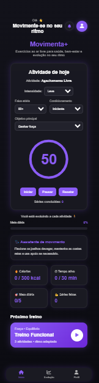

# 💜 Movimenta+

Aplicação web desenvolvida para incentivar exercícios ao ar livre de forma leve, acessível e adaptável ao perfil do usuário.

O projeto foi criado com foco em saúde, bem-estar e evolução progressiva, permitindo acompanhar séries realizadas, calorias gastas, tempo ativo e evolução semanal.

---

# 🚀 Funcionalidades

## 🔐 Autenticação
- Cadastro de usuário
- Login
- Recuperação de senha
- Persistência de sessão

---

## 🏋️ Treinos inteligentes
- Exercícios adaptados ao perfil do usuário
- Alteração dinâmica de:
  - intensidade
  - faixa etária
  - condicionamento
  - objetivo principal

---

## ⏱ Cronômetro interativo
- Iniciar treino
- Pausar treino
- Resetar treino
- Barra circular animada

---

## 📈 Evolução do usuário
- Séries concluídas
- Tempo ativo
- Calorias gastas
- Nível do usuário

---

## 📅 Calendário de treinos
- Dias treinados destacados
- Persistência com LocalStorage

---

## 📊 Gráfico semanal
- Comparativo entre:
  - séries realizadas
  - meta diária

---

## 🔔 Notificações
- Toast personalizado
- Som de alerta
- Lembretes de treino

---

## 👤 Perfil do usuário
- Alteração de foto
- Alteração de e-mail
- Alteração de senha
- Logout

---

# 🛠 Tecnologias utilizadas

- HTML5
- CSS3
- JavaScript
- LocalStorage
- Chart.js
- Font Awesome

---

# 🎨 Layout

O projeto possui:
- design responsivo
- interface moderna
- tema escuro
- componentes interativos
- experiência focada em usabilidade

---

# 📂 Estrutura do projeto

```bash
movimenta-plus/
│
├── assets/
│   ├── audio/
│   ├── icons/
│   └── img/
│
├── index.html
├── login.html
├── cadastro.html
├── perfil.html
├── evolucao.html
│
├── style.css
├── script.js
├── auth.js
│
└── README.md
```

---

# ▶️ Como executar o projeto

## 1. Clone o repositório

```bash
git clone LINK_DO_REPOSITORIO
```

---

## 2. Abra a pasta do projeto

```bash
cd movimenta-plus
```

---

## 3. Execute no navegador

Abra o arquivo:

```bash
index.html
```

ou utilize a extensão:

```txt
Live Server (VS Code)
```

---

# 🌐 Deploy

O projeto está disponível online:

https://movimenta-plus.vercel.app/login.html

---

# 📸 Preview do projeto

As imagens do projeto serão adicionadas após finalização da interface.

Exemplo:

```md

```

---

# 📌 Melhorias futuras

- Backend real
- Banco de dados
- Sistema de ranking
- Histórico de treinos
- Login com Google
- PWA
- API de exercícios

---

# 👨‍💻 Desenvolvedor

Desenvolvido por David Charles 💜

LinkedIn e GitHub serão adicionados futuramente.